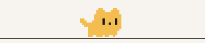
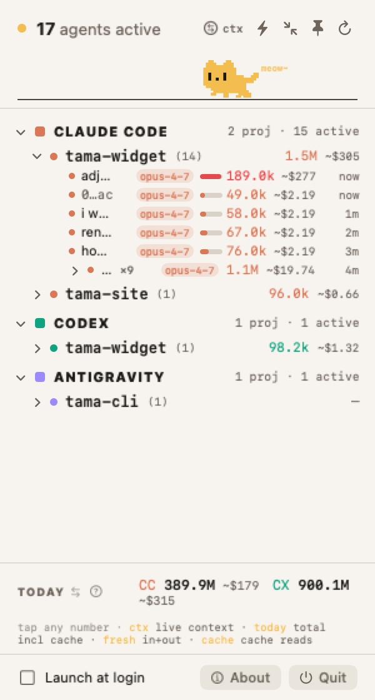
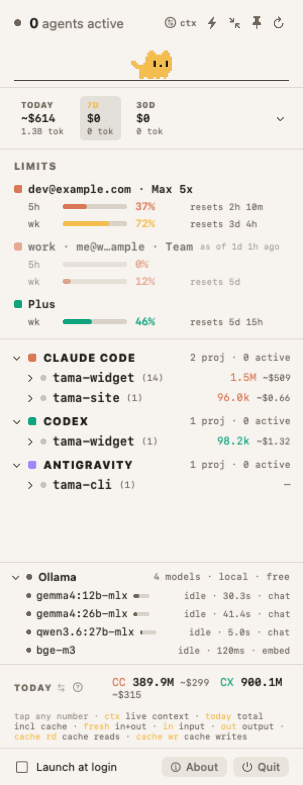
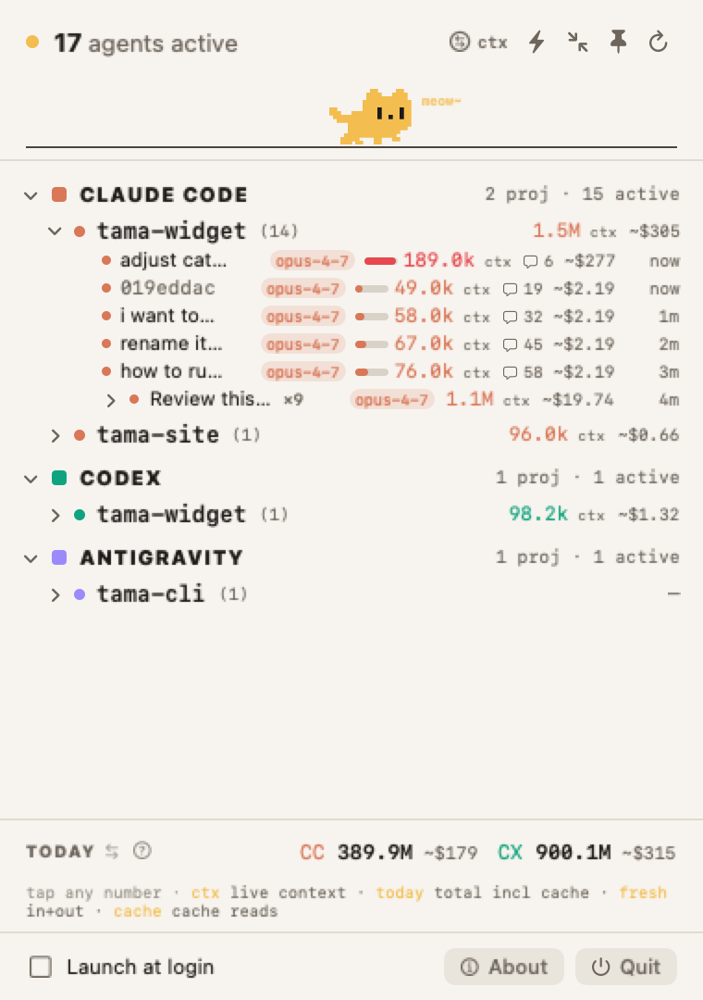
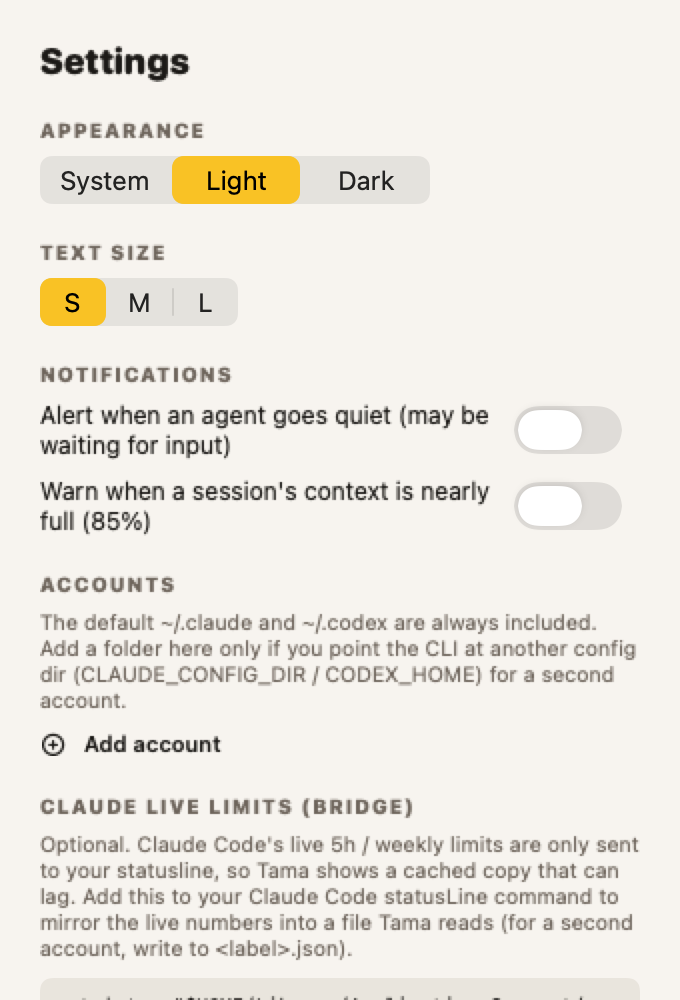
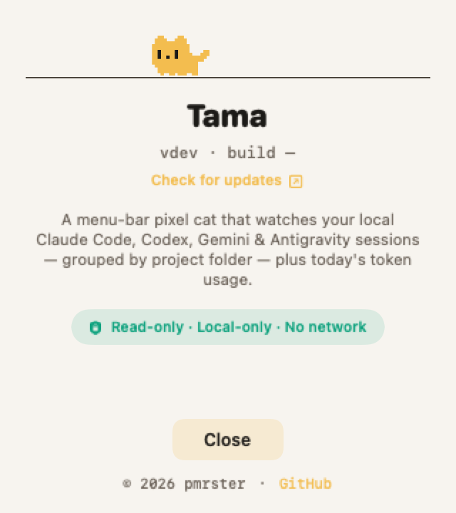

# Tama

A tiny macOS menu-bar cat that watches your local AI coding-agent sessions.

[](https://github.com/pmrster/tama/releases/latest/download/Tama.dmg)

<sub>First launch shows a macOS security prompt (not yet notarized) — open it via **System Settings → Privacy & Security → Open Anyway**. [Full steps ↓](#download)</sub>

[](LICENSE)
&nbsp;[](#download)
&nbsp;[](#run-from-source)

<p align="center">
  <picture>
    <source media="(prefers-color-scheme: dark)" srcset="assets/cat-walk-dark.gif">
    
  </picture>
</p>

Tama lives in the menu bar and shows how many Claude Code, Codex, Gemini CLI, and
Antigravity sessions are recently active on your Mac — grouped by project folder —
plus how full each session's context window is and how many tokens you've used today.

It is **read-only, local-only, and has no automatic network activity**. Tama reads the
agents' own local log files; it never writes to them, spawns a process, phones home,
or sends data anywhere. The only network-adjacent actions are user-clicked buttons
that hand GitHub URLs to your browser. This is a hard design invariant, enforced by
tests — see [Safety](#safety-model).

<p align="center">
  <picture>
    <source media="(prefers-color-scheme: dark)" srcset="assets/dashboard-dark.png">
    
  </picture>
  &nbsp;
  <picture>
    <source media="(prefers-color-scheme: dark)" srcset="assets/dashboard-sleep-dark.png">
    
  </picture>
</p>
<p align="center"><sub>Busy (left): sessions across projects, with live context and today's token totals. Idle (right): nothing running, so the cat curls up for a nap.</sub></p>

> Screenshots use synthetic demo data — Tama only ever reads your own local logs.

## What it shows

A pixel cat and a count sit in the menu bar; the count is how many sessions are
active *right now*. Click it for the tree, grouped **provider → folder → session**:

```text
menu bar:  🐱 3

● 3 agents active

▾ CLAUDE CODE                       2 proj · 2 active
  ▾ tama-widget (2)                 91.4k ctx ~$3.05
      Rename app    opus-4-8  ▇▇▁  48.2k ~$1.40   3m
      Fix tests     opus-4-8  ▇▇▁  43.2k ~$1.65   8m
    api-tool (1)                     1.2k ctx ~$0.08

▸ CODEX                             1 proj · 0 active

TODAY                       CC 1.2M ~$4.10   CX 240k ~$0.80
```

Each session row shows its name (the opening prompt, or a short id), the model, a
context-fill gauge with the live token count, an estimated cost, and how long ago it
was active. Hover a row — or widen the pinned window — to see its **message count**:
the conversation length, the same number Claude Code's `/resume` picker shows.

Header controls let you toggle whether folders display **live context** or **today's
tokens**, filter to only sessions active right now, expand/collapse all folders, pin
the window so it stays on screen, or refresh immediately.

### Two different token numbers

There are **two token numbers per session, and they are not the same thing** — they
can differ by orders of magnitude, and both are real:

- **`ctx` — live context-window occupancy.** How full a session's context window is
  *right now* (the size of the current conversation on the last turn). Shown per
  session with a fill gauge, and summed per project folder. The gauge turns red as the
  window approaches full.
- **`TODAY` — cumulative tokens processed today** (local calendar day), **including
  cache reads**, summed across every session. Every turn re-reads the whole context,
  so cache re-reads dominate and this number is far larger than any single `ctx`.

### Cost is an estimate, not your bill

The `~$` figures (per session, per project, and per provider) are an **estimated**
pay-as-you-go API cost, priced from public per-million-token API rates in
[`prices.json`](Sources/TamaCore/Resources/prices.json). Input, output, cache-read,
and cache-write tokens are priced separately because they cost very different amounts.

This is **not your actual bill.** Claude Max / ChatGPT subscriptions are billed
differently (often a flat fee), so treat `~$` as a relative gauge of where your tokens
are going, not an invoice.

## Privacy

Tama does not collect, transmit, sell, or share personal data. All scanning and cost
estimation happens on your Mac from local agent logs. See [PRIVACY.md](PRIVACY.md)
for the full privacy statement.

## Screens

<table>
<tr>
<td align="center" valign="top">
  <picture>
    <source media="(prefers-color-scheme: dark)" srcset="assets/pinned-dark.png">
    
  </picture>
  <br><sub><b>Pinned window</b> — resizable; full session names &amp; message counts</sub>
</td>
<td align="center" valign="top">
  <picture>
    <source media="(prefers-color-scheme: dark)" srcset="assets/settings-dark.png">
    
  </picture>
  <br><sub><b>Settings</b> — appearance &amp; text size</sub>
  <br><br>
  <picture>
    <source media="(prefers-color-scheme: dark)" srcset="assets/about-dark.png">
    
  </picture>
  <br><sub><b>About</b></sub>
</td>
</tr>
</table>

## Providers

| Provider        | Active + folder | Live `ctx` | Today's tokens | Model | Est. cost |
| --------------- | :-------------: | :--------: | :------------: | :---: | :-------: |
| Claude Code     |       ✅        |     ✅     |       ✅       |  ✅   |    ✅     |
| Codex           |       ✅        |     ✅     |       ✅       |  ✅   |    ✅     |
| Gemini CLI      |       ✅        |     —      |       —        |   —   |     —     |
| Antigravity     |       ✅        |     —      |       —        |   —   |     —     |

Gemini CLI and Antigravity appear by folder and recency only — their plain logs carry
no token counts, so token, cost, and `ctx` all show `—`.

## Download

[**⬇ Download Tama.dmg**](https://github.com/pmrster/tama/releases/latest/download/Tama.dmg)
— latest release. Open the `.dmg` and drag **Tama** into the **Applications** folder shown
in the window.

Tama is in active development — notarized builds are on the roadmap. Until then, like any app
distributed outside the App Store, macOS shows a security prompt on first launch. Open it once
using Apple's standard step (no Terminal):

1. Double-click **Tama** → at the prompt, click **Done**.
2. **System Settings → Privacy & Security** → scroll to the Tama message → **Open Anyway** → **Open**.

It launches normally after that. (On older macOS: right-click the app → **Open** → **Open**.)

> Saw *"Tama is damaged"* on an earlier download? Please redownload — that was a packaging bug,
> now fixed.

Checksums and previous versions are on the
[releases page](https://github.com/pmrster/tama/releases/latest). Prefer to build it
yourself? See [Run from source](#run-from-source).

## Build it yourself

No automated releases yet — building the `.dmg` is a manual `package.sh` run:

```bash
swift test                 # run the full test suite
Packaging/package.sh 0.2.2 # → dist/Tama.app + dist/Tama-0.2.2.dmg (+ Tama.dmg)
open "dist/Tama.app"
```

For a public release build, require Developer ID signing and notarization:

```bash
SIGN_IDENTITY="Developer ID Application: Your Name (TEAMID)" \
NOTARY_PROFILE="tama-notary" \
REQUIRE_NOTARIZATION=1 \
Packaging/package.sh 0.2.2
```

To keep it around:

```bash
cp -R "dist/Tama.app" /Applications/
```

The app has no Dock icon (it runs as a menu-bar agent / `LSUIElement`). Look for the
cat and count at the top-right of the menu bar. Quit from the dropdown's **Quit**
button, or run `pkill -x Tama`.

## Run from source

Requirements: **macOS 13+** and **Swift 6 / Xcode 16+**. This is a SwiftPM package —
there is no `.xcodeproj`.

```bash
swift build           # debug build
swift test            # full suite
swift run Tama        # run from source; the menu-bar item appears top-right
```

## How it works

Tama makes one cached, read-only pass over the agents' local logs every few seconds
(every 7s while the window is open, every 30s in the background) and groups what it
finds. Parsing is cached per file by `(mtime, size)`, so only the log currently being
written is re-read on each pass.

**Active** means a session's log was written within the last **15 minutes**.

Token data is read for the current local calendar day, from each provider's own logs:

| Provider     | Log location                                          |
| ------------ | ----------------------------------------------------- |
| Claude Code  | `~/.claude/projects/<project>/<session>.jsonl`        |
| Codex        | `~/.codex/sessions/YYYY/MM/DD/rollout-<id>.jsonl`     |
| Gemini CLI   | `~/.gemini/tmp/*/.project_root` (folder + recency)    |
| Antigravity  | `~/.gemini/antigravity-cli/history.jsonl` (folder + recency) |

How each number is computed:

- **Today's cumulative tokens** — sum, over today's turns, of input + output +
  cache-read + cache-write. *Fresh* tokens are `input + output`; the rest is cache.
- **Live context occupancy** —
  - *Claude Code:* the most recent non-sidechain turn's input + cache + output.
    Claude logs don't record the window size, so it's inferred: default **200K**,
    promoted to **1M** when occupancy exceeds 200K or the model id is a `[1m]` variant.
  - *Codex:* the last `token_count` event's last-turn input + output, with the window
    read straight from the log's `model_context_window`.
- **Estimated cost** — each token type priced from
  [`prices.json`](Sources/TamaCore/Resources/prices.json) (USD per 1M tokens).
- **Session name** — the conversation's opening user prompt (Codex's IDE wrapper is
  stripped), falling back to the short session id.
- **Message count** — user + assistant turns; matches Claude Code's `/resume` count.

### Architecture

Two SwiftPM targets with a deliberate split:

- **`TamaCore`** — all logic, zero UI. Every type takes its dependencies by injection
  (clock, log directories, calendar), so it's fully unit-tested without real files or
  the real clock.
- **`Tama`** — the thin SwiftUI/AppKit shell that hosts the dashboard in both a
  `MenuBarExtra` popover and a pinnable floating window.

## Safety model

Tama is designed to be boringly safe:

- **Read-only.** It reads logs under `~/.claude`, `~/.codex`, and `~/.gemini` using
  read-only memory-mapped reads; it never writes back to those folders.
- **Local-only.** No analytics, telemetry, automatic update checks, or in-app network
  requests. The About window has user-clicked GitHub links that open in your browser.
- **No command execution.** The running app never spawns a shell command or process.
- **No root or helper daemon.** It runs as your normal macOS user.
- **Hardened file reads.** Readers reject symlinks, non-regular files, and oversized
  files before opening them.

A test snapshots the log fixture tree before and after a scan and asserts it is
byte-identical, so the readers provably never modify the filesystem. Worst case, Tama
shows incomplete or wrong numbers — it should never be able to delete, modify, execute,
or transmit your data. See [SECURITY.md](SECURITY.md) and [PRIVACY.md](PRIVACY.md).

## Contributing

Issues and pull requests are welcome.

- Run `swift test` before opening a PR; keep the suite green.
- Logic lives in `TamaCore` and should stay fully testable (dependencies injected, no
  AppKit). The `Tama` target is the thin UI shell.
- **Never break the safety invariant.** No writes to agent log directories, no process
  spawning, no automatic network activity. If you add a provider or reader, extend the
  safety test to cover it.

## Project status

- No release automation is configured yet; build locally with `Packaging/package.sh`.
- Roadmap: signed & notarized builds → GitHub Release artifacts with checksums →
  Homebrew cask once there's a stable signed release.
- See [CHANGELOG.md](CHANGELOG.md) for what's changed.

## License

[MIT](LICENSE).
